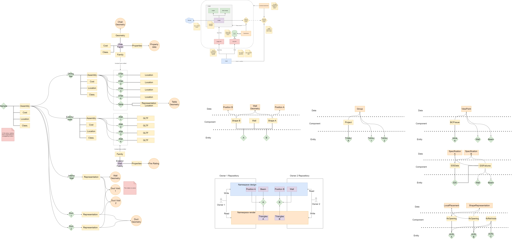

# ecs_ifc_structures




```


commits group component adds/removes/edits
entities are never explicitly added or removed

entities are global, but components live in a hierarchy with paths seperated by /
    paths mainly serve as data partitioning, and rights boundaries

component types are explicitly added but never edited nor removed

For unqueryable binary contents, the blob type is used. 
    Blobs can be uploaded and downloaded as is but not inspected deeper by the ecs code.

!!! A user should be able to download commits scoped to his rights in terms of types and paths, and still contribute to the repository
Essentially, this means that commits don't have a strict "precedes" attribute 
    and instead are valid if they don't violate constraints, inserted in the order determined by the server
    
Component (c2n98e23981022, ifc2x3::cartesianpoint, 1) (human readable id) 
        <=> 
(9382,15,1) (internal numeric id) <=> 000024A6-000F-0001  (fused hex 64 bit, flip order to increase locality of reference)

maximum counts:
    entities: 4 billion
    types: 65k
    components of same type per entity: 65k 

Commit: Author:         bob@bob.com
        Message:        moved wall
        Date:           19/04/2023
        Application:    Revit
        Hash:           9cn823r09c123898
        Context:        [0cn924c81328c129, 49c82n30c283743]
        Scope: *
            Add type ifc2x3::cartesianpoint (x,y,z)
        Scope:          /project/files/arch.ifc
            modify:     Add Component 3819238


Path: (address: /project/files/arch.ifc, components: [3819238])

Entites: [13]

ComponentType {
    name: ifc2x3::cartesianpoint
    schema: {
        x: real,
        y: real,
        z: real,
        parent: optional reference ifc2x3::cartesianpoint,
        blob: blobid
    }
}

Component {
    ID: (entity: 13, type: ifc2x3::cartesianpoint, number: 1)
    hash: 2cm8r2c2389c09m2349023,
    deephash: 03298nc0293847cn092s,
    data: {
        x: 23,
        y: 10,
        z: 9,
        parent: 000024A6-000F-0001,
        blob: 40c298n43c9384c09384c
    }
}

Blob {
    ID: 40c298n43c9384c09384c                  // hash of the blob
    data: [...]
}

User: Name: Bob
      Email: bob@bob.com
      Rights: 
        Scopes: /project/files/*
        Types: ifc2x3::cartesianpoint

API:

 -- ledger
POST /ledger/commit 
GET /ledger/<commit_id>                        // get commit by id, filter on type
GET /ledger/scope/<path>/entity/<entity_id>    // get commits for scope/entity, filter on type, truncate to number or revision
WS  /ledger/scope/<path>                       // get notified of commits on path, filtered by types

 -- blobs
POST /blob/
GET /blob/<blob_id>                            // get blob by id 

 -- query
GET /ecs/<commit_id>/scope/<path>/entity/<entity_id>        // get components for scope/entity, filter on type
GET /ecs/<commit_id>/scope/<path>/components/<component_id> // get component by id, filter on sub-component properties
GET /ecs/components/types                                   // get all component types
GET /ecs/entities                                           // get all known entities

```
